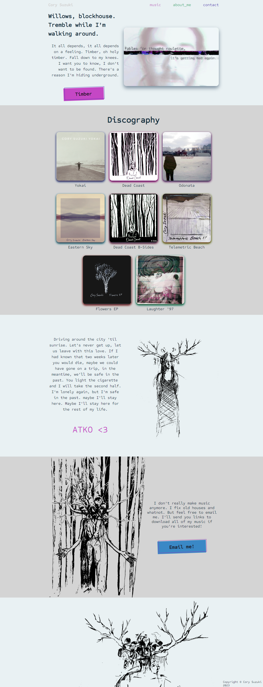

# Landing Page - Odin Foundations

The assignment was to create a web page based on the <a href="design/assignment-template.png">design</a> provided, with a focus on utilizing Flexbox.

## My Process

- First I used Gimp to create some <a href="design/landing-page-layout-v1.png">mockups</a> of the <a href="design/landing-page-mobile-layout-v1.png">page</a> I had in mind.
- Next, I downloaded Figma and spent some time learning how to use the program before creating a more refined <a href="design/final-layout-figma.png">mockup of my web page</a>.
- With a design in mind, I started coding. One thing led to another and I ended up learning a little about media queries to make the page _somewhat_ responsive. I also added a few additional html pages for the site and linked to them from index.html. 
- Once I was happy with the <a href="design/final-website.png">website</a>, I put together a design folder in the project repository that includes all of the mockups as well as a page I made in Gimp outlining the <a href="design/theme-color-font.png">themes</a> of the page, including the colors and font used.
- And finally, here I am learning wtf markdown is...I guess it's like .text and .html had a baby? 
- Oh, one more thing. Acknowledgments...all the drawing on the page are by me, and the music being linked to are also by yours truly. 

## Snapshot of my landing page

